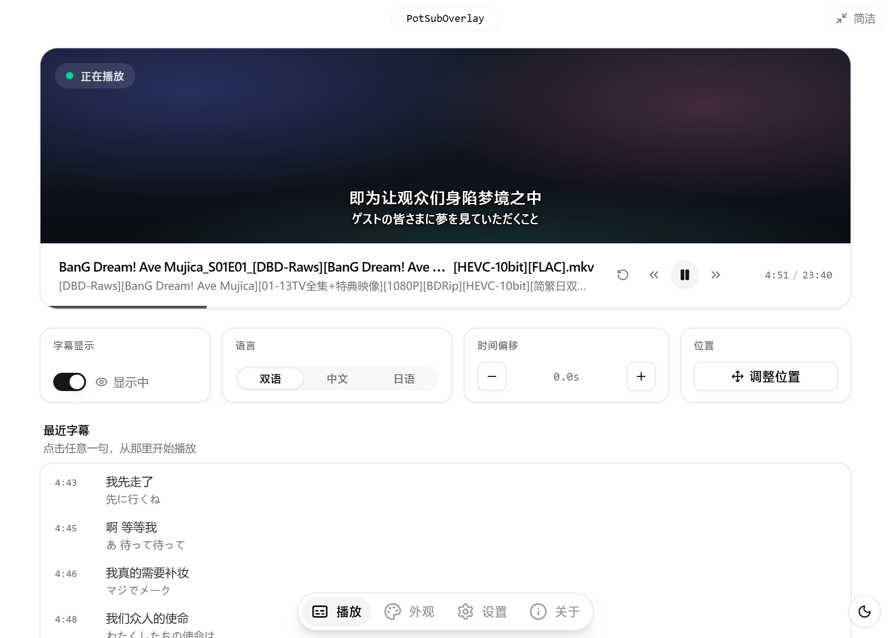
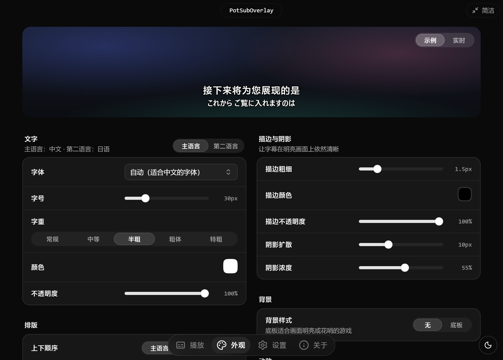
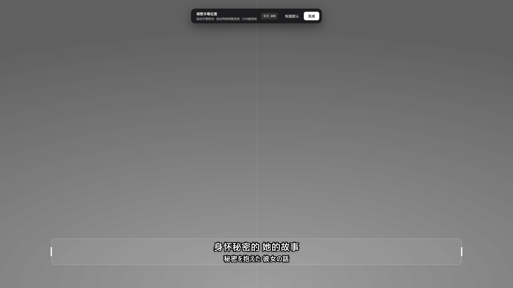
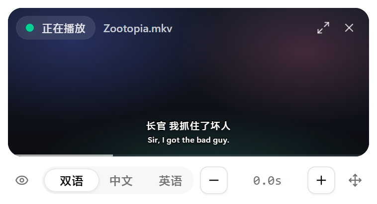

<div align="center">


# PotSubOverlay

**把 PotPlayer 正在播放的字幕，放到游戏画面上。**

后台播放外语动画、电视剧、ASMR、音声作品，前台打游戏——字幕以透明、置顶、鼠标穿透的字幕条固定在你想要的位置，支持双语两行（中日、中英、日英、韩英……）。

[下载最新版](https://github.com/QiuYeDx/PotSubOverlay/releases/latest) · Windows 11 · MIT

</div>



## 特性

- **零操作对时**：直接读取 PotPlayer 的播放进度、状态和当前文件路径，暂停、拖动进度、切换下一集都会自动跟上。
- **自动加载同名字幕**：在媒体所在文件夹查找 `.srt` `.ass` `.ssa` `.vtt` `.lrc`，支持 `名字.ja.srt`、`名字.scjp.ass`、`名字.mp3.vtt` 等常见命名；自动识别 UTF-8 / UTF-16 / GBK / Shift-JIS / Big5 编码；文件夹里新增字幕会自动重新加载。
- **双语两行，不限语言组合**：
  - 识别中文、日语、韩语、英语、法语、德语、西班牙语、葡萄牙语、意大利语、俄语、泰语、越南语、阿拉伯语；
  - 单文件双语（字幕组常见的 `中文\N日文`、中英双语 SRT、双语 LRC 同一时间戳两行）与多个单语文件自动合并都支持；
  - 按“主语言 / 第二语言”工作：主语言可在设置中选择（默认中文），默认在上方，可切换顺序；可选择 **双语 / 仅主语言 / 仅第二语言**，界面上直接显示语言名；
  - 主语言与第二语言分别设置字体（默认按语言自动选择）、字号、字重、颜色。
- **不打扰游戏**：字幕窗口透明、置顶、鼠标点击穿透、不抢焦点；PotPlayer 在前台时自动隐藏，避免和播放器自带字幕重复。
- **随手调整**：进入编辑模式直接拖动字幕位置、拉伸宽度，带居中吸附；位置按显示器比例保存，支持多显示器。
- **为真实字幕而做**：过滤 ASS 中的定位特效与屏幕字；YouTube 机翻字幕的“滚动重复行”自动去重。
- **多个 PotPlayer 窗口**：默认自动跟随正在播放的那个，也可以手动指定。
- **完整 / 简洁两种模式**：简洁模式是一个可置顶的迷你控制条，适合边玩边调。
- **全局快捷键**（可自定义）：

  | 功能 | 默认 |
  |---|---|
  | 显示 / 隐藏字幕 | `Ctrl+Alt+S` |
  | 调整字幕位置 | `Ctrl+Alt+P` |
  | 切换 双语 / 主语言 / 第二语言 | `Ctrl+Alt+J` |
  | 字幕提前 / 延后（默认 0.5s） | `Ctrl+Alt+[` / `Ctrl+Alt+]` |

- 简体中文 / 繁體中文 / English / 日本語 界面，浅色 / 深色主题，托盘常驻（菜单与应用同一套设计），开机启动。

| 外观设置 | 调整位置 | 简洁模式 |
|---|---|---|
|  |  |  |

## 使用

1. 从 [Releases](https://github.com/QiuYeDx/PotSubOverlay/releases/latest) 下载并安装 `PotSubOverlay_x.y.z_x64.exe`。
2. 用 PotPlayer 播放视频或音频，把同名字幕放在同一个文件夹（例如 `第01话.mkv` + `第01话.scjp.ass`）。
3. 打开 PotSubOverlay，字幕会出现在屏幕底部；按 `Ctrl+Alt+P` 拖到合适的位置。
4. 把游戏设为 **无边框窗口 / 窗口化全屏** 后开始游戏。

> [!IMPORTANT]
> 任何置顶窗口都无法覆盖 **独占全屏** 的游戏。大多数 DX12 游戏的“全屏”本质上就是无边框窗口；少数 DX11 及更早的游戏需要在设置里手动改成无边框窗口。

### 字幕命名规则

在媒体文件同目录下，以下文件都会被识别（`名字` 为媒体文件名去掉扩展名）：

```text
名字.srt / 名字.ass / 名字.ssa / 名字.vtt / 名字.lrc
名字.<标记>.<扩展名>        例如 名字.ja.srt、名字.chs.ass、名字.scjp.ass
名字.mp4.vtt               媒体完整文件名 + 扩展名（asmr.one 等常见）
```

`zh/chs/cht/sc/tc`、`ja/jp/jpn`、`en/eng`、`ko/kor`、`fr`、`de`、`es`、`ru` 等标记，以及 `scjp`、`chseng`、`zh-en`、`简日`、`中英双语` 这类组合都会作为语言提示；不带标记时根据内容自动判断（文字系统 + 拉丁语系功能词 + 文件内位置 / 样式投票）。同时存在多个时默认优先包含主语言的双语文件，其次“主语言文件 + 另一种语言文件”，并优先简体（可改为繁体）、ASS 格式；你也可以在“字幕文件”里手动勾选，或把任意字幕文件拖进窗口。

## 工作原理

- PotPlayer 支持通过窗口消息查询状态：`WM_USER + 0x5004` 当前位置、`0x5002` 总时长、`0x5006` 播放状态；`0x6020` 会以 `WM_COPYDATA` 回传当前文件的完整路径（UTF-8）。
- 主进程通过 [koffi](https://koffi.dev/) 调用 `user32`，每 50ms 轮询播放中的实例；字幕解析、语言识别与时间轴查询都在主进程完成，只在文字变化时推送给字幕窗口。
- 字幕窗口是透明的 Electron 窗口，使用 `setIgnoreMouseEvents` 实现穿透，渲染与控制面板的实时预览共用同一个组件。

更完整的设计见 [docs/开发设计文档/potsuboverlay_final_design.md](docs/开发设计文档/potsuboverlay_final_design.md)。

## 开发

环境：Node.js `^22.12.0 || ^24.0.0`（推荐 24）、pnpm `8.7.0`（通过 corepack）、Windows 11。

```bash
corepack enable
corepack pnpm install
corepack pnpm dev            # Vite + Electron
corepack pnpm check          # typecheck + i18n + 单元测试
corepack pnpm release:win    # 构建 NSIS 安装包到 release/
```

常用工具：

```bash
# 查看某个媒体文件会加载哪些字幕、如何识别语言
corepack pnpm subtitle:inspect "D:/Anime/第01话.mkv"

# 修改 src/assets/app-logo.svg 后重新生成图标
corepack pnpm icons:build
```

开发调试时可以设置环境变量 `POTSUB_FAKE_PLAYER="<媒体路径>|<起始毫秒>"`，用模拟播放器代替 PotPlayer；`POTSUB_QA_SCRIPT` 可以驱动窗口截图做视觉验收（见 `electron/main/qa.ts`）。

技术栈：Electron 41 · React 19 · TypeScript · Vite · Tailwind CSS 4 · shadcn/ui · [qiuye-ui](https://ui.qiuyedx.com/) · Motion · Zustand · i18next · koffi，基于 [qiuye-electron-template](https://github.com/QiuYeDx/qiuye-electron-template)（`electron-modern`）。

## 许可

[MIT](LICENSE) © QiuYeDx

PotPlayer 是 Kakao 的产品，本项目与其无关联。
